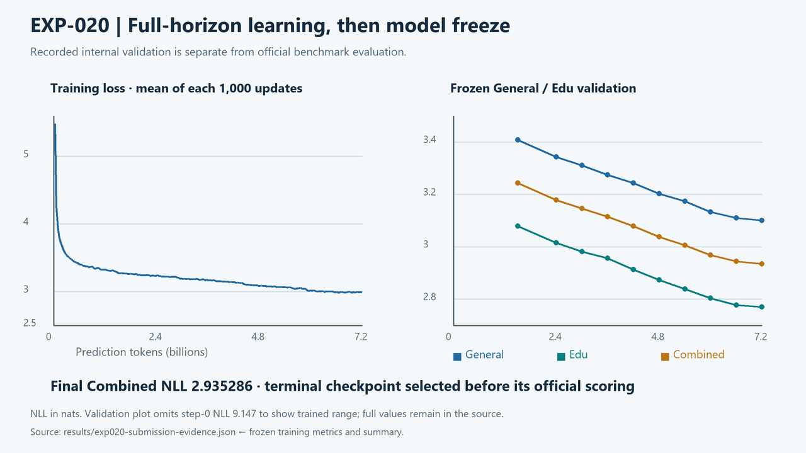
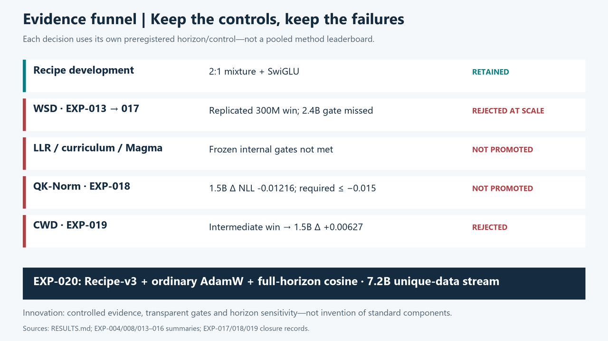
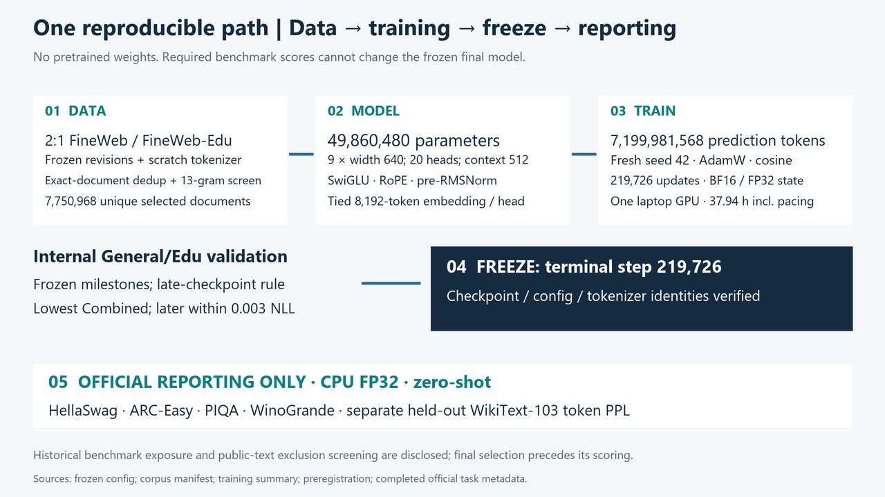

# GIBC V2 Track 01 · 49.86M parameters, trained from scratch

**EXP-020 is the frozen competition model:** **49,860,480 trainable parameters** (below the 50M cap), **7,199,981,568 prediction tokens**, **one RTX 5090 Laptop GPU**, and **37.94 hours** of final training including thermal pacing. No pretrained model initialization, fine-tuning or distillation.

**[Download the frozen EXP-020 model, tokenizer and inference package](https://huggingface.co/AryaErgin/gibc-v2-exp020)** · [Pinned release and hash verification](docs/submission/PUBLIC_RELEASE.md)

| Required benchmark | Final result | EXP-012 reference | Change |
|---|---:|---:|---:|
| WikiText-103 held-out token PPL ↓ | **31.783** | 35.939 | −4.156 |
| HellaSwag acc_norm ↑ | **30.163%** | 28.759% | +1.404 pp |
| ARC-Easy acc_norm ↑ | **39.141%** | 36.448% | +2.694 pp |
| PIQA acc_norm ↑ | **60.446%** | 60.229% | +0.218 pp |
| WinoGrande acc ↑ | **48.777%** | 50.355% | −1.579 pp |

HellaSwag and ARC-Easy improved; PIQA was roughly stable; WinoGrande regressed. These are descriptive single-run comparisons, not evidence of universal reasoning improvement or statistical significance.

[Exact results & uncertainty](RESULTS.md) · [Frozen evidence & hashes](results/exp020-submission-evidence.json) · [Reproducibility](docs/submission/REPRODUCIBILITY.md) · [3:30 demo storyboard](docs/submission/DEMO_STORYBOARD.md)



*Measured training-loss bins and frozen General/Edu validation, extracted from the final run logs. These validation curves are not official benchmark scores. [Figure data and captions](docs/assets/exp020/README.md).*

## What we built—and learned

A compact decoder-only Transformer: 8,192-token byte-level BPE, width 640, nine blocks, twenty attention heads, SwiGLU, RoPE, pre-RMSNorm and tied embeddings. The final optimizer is ordinary AdamW with a cosine schedule fixed over all 219,726 updates. [Architecture and exact parameter accounting](ARCHITECTURE.md).

Our contribution is the experimental evidence and the instrument that produced it: controlled interventions, preregistered promotion gates, retained negative results, a deterministic contamination-screened corpus, and checkpoint selection using internal validation before final-model benchmark scoring.

Short-horizon wins did not consistently survive longer training here. WSD passed a replicated 300M-token comparison but missed its 2.4B gate; QK-Norm's advantage narrowed below its 1.5B promotion gate; Cautious Weight Decay's intermediate advantage reversed at 1.5B. None is in EXP-020. [Experiment decisions](EXPERIMENT_LOG.md) · [Method results](RESULTS.md).





*Recorded configuration and provenance, not a new experiment. [Pipeline sources and caption](docs/assets/exp020/README.md).*

## Training and data

The final run read a non-cycled 2:1 FineWeb/FineWeb-Edu stream, built from zero with global exact-document deduplication. It contains **7,750,968 unique selected documents**. The first EXP-011 and EXP-012 token prefixes match their historical SHA-256 identities exactly. The frozen tokenizer was trained from scratch. [Data revisions, counts and contamination limits](DATA_SOURCES.md).

Training used WSL2, Python 3.11.9, PyTorch 2.13.0+cu132, BF16 forward computation with FP32 model/optimizer state, context 512, microbatch 32 × accumulation 2, seed 42, and fixed 0.300-second sleep after updates. Logged mean active throughput was 104,140 tok/s; mean paced step throughput was 53,276 tok/s. Total tokens divided by total training wall time is about 52,713 tok/s. Peak reserved VRAM was 8.680 GB decimal (8.084 GiB). The 37.94 hours describes this final run, not the entire research campaign. [Full training record](results/EXP-020-summary.md).

**Approximate final-run training compute:** using the conventional 6NT estimate, `6 × 49,860,480 × 7,199,981,568 = 2,153,967,221,829,795,840 FLOPs ≈ 2.154e18 FLOPs ≈ 2.154 EFLOPs`. This is an approximate theoretical training-compute estimate—not measured electrical energy, exact hardware FLOPs, or total research-campaign compute.

## Frozen evaluation, transparent limitations

Official EXP-020 scoring completed on 2026-09-08, after checkpoint selection. The four multiple-choice tasks used unchanged lm-eval 0.4.9.1 task definitions, CPU FP32, zero-shot, batch 16, context 512. WikiText-103 used the separately pinned held-out rolling evaluator. Internal General/Edu validation selected the checkpoint; required benchmark results are final reporting only.

Historical models had earlier benchmark evaluations, and public benchmark text was used for exclusion screening. “Benchmark-blind selection” refers specifically to selection of the final EXP-020 checkpoint before its official scores, not a claim that no benchmark had ever been accessed.

The normalized 13-gram screen cannot rule out every semantic overlap. The final scale has one seed and no contemporaneous 7.2B alternative; performance changes cannot be causally assigned to an individual component. This is a base language model, not an instruction-tuned assistant. No SOTA, energy-efficiency or generalized-reasoning claim is made.

## Audit in minutes

The checked-in digest and figures can be inspected without weights, GPU access, network access or benchmark requests:

```bash
python scripts/verify_submission_package.py
```

A model-count check is also available with the project's existing PyTorch environment:

```bash
python scripts/count_parameters.py \
  --config configs/exp020-final-7p2b-cosine.yaml --expected-total 49860480 --json
```

## Setup and local usage

Prerequisites: Python 3.11, a virtual environment and the qualified PyTorch build; CPU inference needs no GPU. Clone the [source repository](https://github.com/AryaErgin/gibc-v2-foundational-llm), then:

```bash
python3.11 -m venv .venv
source .venv/bin/activate
python -m pip install torch==2.13.0 --index-url https://download.pytorch.org/whl/cu132
python -m pip install -e ".[dev]"
python scripts/count_parameters.py --config configs/exp020-final-7p2b-cosine.yaml --expected-total 49860480 --json
```

Do not change an existing qualified evaluation environment. The **[public inference-only safetensors package](https://huggingface.co/AryaErgin/gibc-v2-exp020)** includes the exact frozen weights, tokenizer/config, CPU loader, parameter/hash verifier, model card and provenance—no dataset or optimizer state. A separate [clean-environment smoke](docs/submission/PREPUBLICATION_SMOKE.md) passed offline loading and one deterministic non-benchmark generation. [Pinned download and verification instructions](docs/submission/EXP020_RELEASE.md). Once downloaded:

```bash
CUDA_VISIBLE_DEVICES="" python -B /path/to/exp020-package/verify.py
CUDA_VISIBLE_DEVICES="" python -B /path/to/exp020-package/generate.py "The purpose of scientific measurement is" --max-new-tokens 64
```

The second command is for manual local use, not a benchmark or model-selection step. The architecture is custom PyTorch, not Transformers AutoModel-compatible. No inference was run during this final publication reconciliation; the separately authorized smoke is documented above.

[Reproducibility](docs/submission/REPRODUCIBILITY.md) maps frozen artifacts. Official evaluation used `scripts/run_exp020_official_sequence.py` and its CPU evaluator modules; see the [protocol](docs/EXP020_OFFICIAL_EVALUATION_PROTOCOL.md) for exact scripts, task order and WikiText rolling semantics. Full evaluator commit: `37332797909df963ca7c77a945cea8752b60d481`; four raw harness artifacts record short `3733279`. PIQA mirror/exclusion-snapshot byte equivalence is **not established**; this limits contamination-coverage claims, not permission to revise scores.

## Submission map and credits

Training data: HuggingFaceFW FineWeb/FineWeb-Edu and Common Crawl. Frameworks/tools: Python, PyTorch/native SDPA, Hugging Face datasets/tokenizers/safetensors, EleutherAI lm-eval, NumPy, PyArrow, PyYAML and SQLite; NVIDIA RTX 5090 Laptop GPU/CUDA, Windows/WSL and OMEN; Git/GitHub, pytest and Pillow. Benchmark authors are credited in the [license/bibliography audit](docs/submission/LICENSE_AUDIT.md). [All six Devpost components and complete Built With checklist](docs/submission/COMPLIANCE.md).

- [Devpost draft](docs/submission/DEVPOST_DRAFT.md), [demo storyboard](docs/submission/DEMO_STORYBOARD.md), [skeptical judge review](docs/submission/JUDGE_REVIEW.md)
- [Results](RESULTS.md), [experiment log](EXPERIMENT_LOG.md), [current project status](PROJECT_PLAN.md)
- [Evidence audit](docs/submission/EVIDENCE_AUDIT.md), [official evaluation protocol](docs/EXP020_OFFICIAL_EVALUATION_PROTOCOL.md)
- [Source ledger](SOURCE_LEDGER.md), [code attribution](CODE_ATTRIBUTION.md), [bibliography](REFERENCES.bib), [license](LICENSE)

**AI assistance:** ChatGPT, Deep Research and OpenAI Codex supported research review, implementation, testing, profiling, audits and documentation. Human review retained scientific and publication authority. [Disclosure](AI_ASSISTANCE.md).
