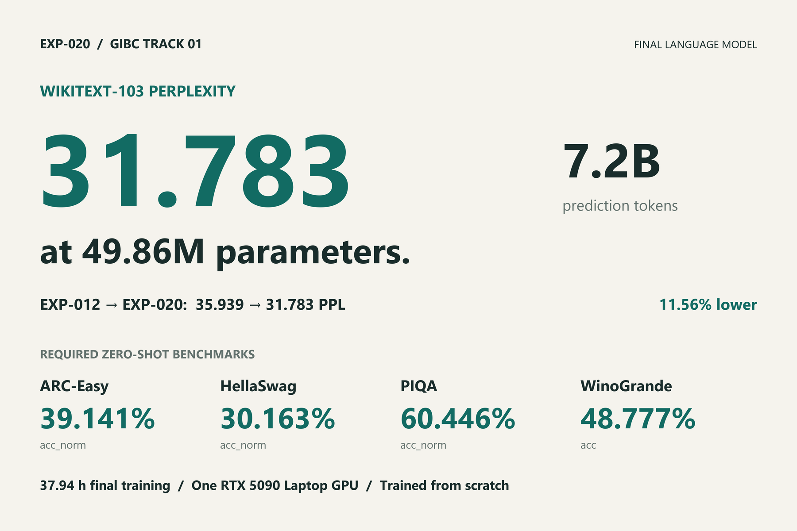
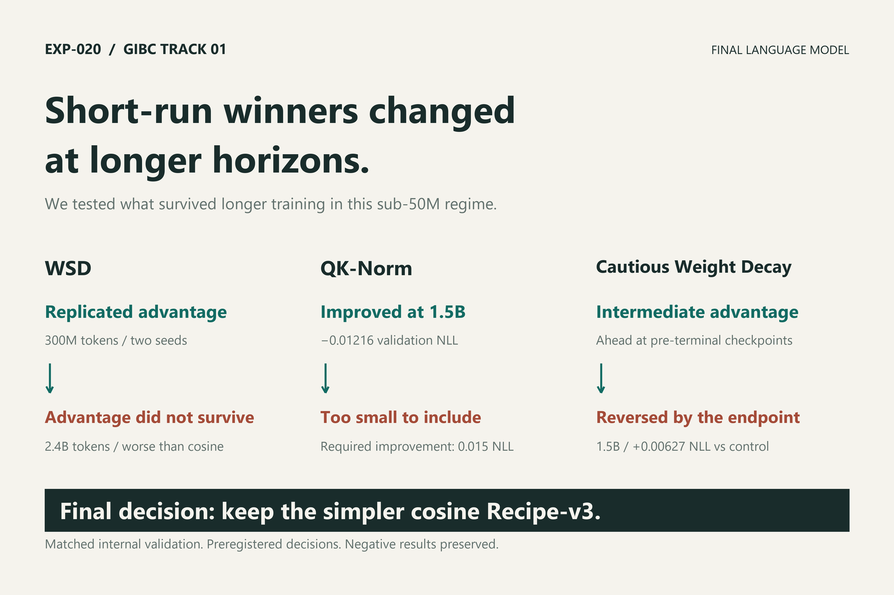
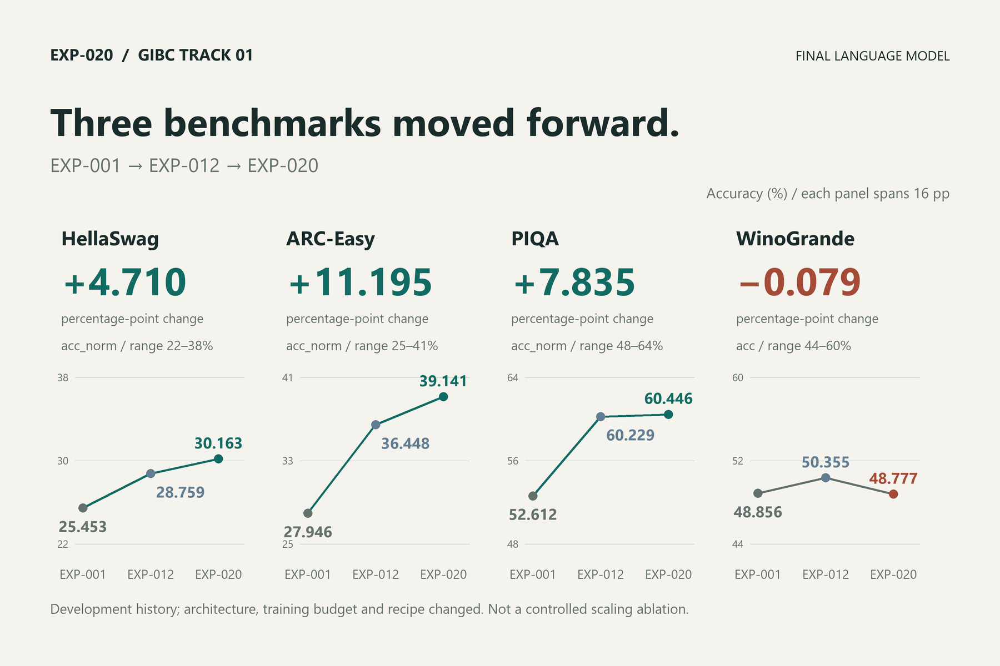
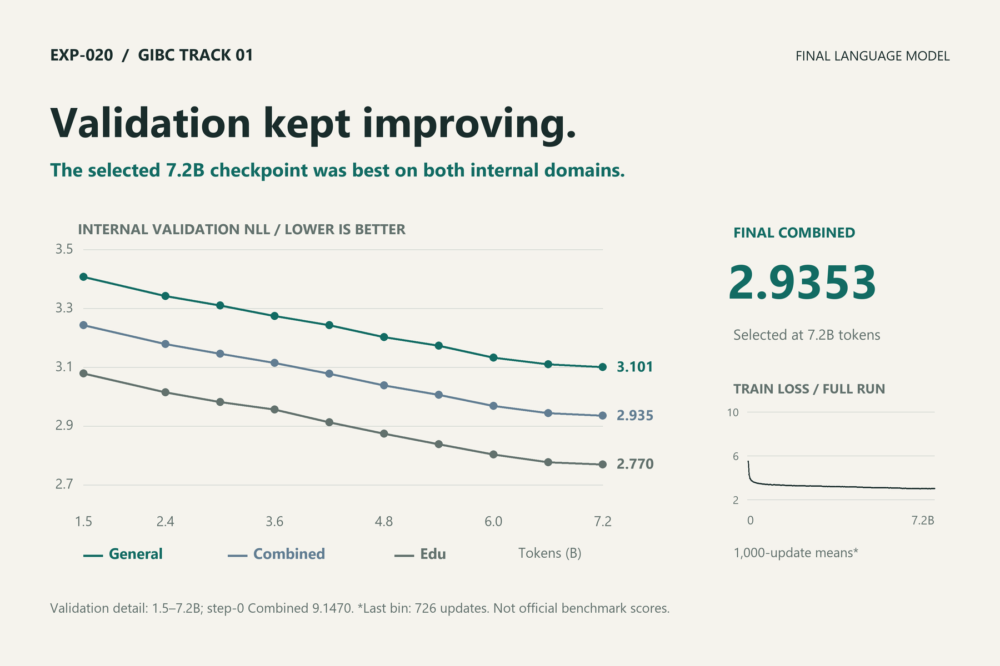
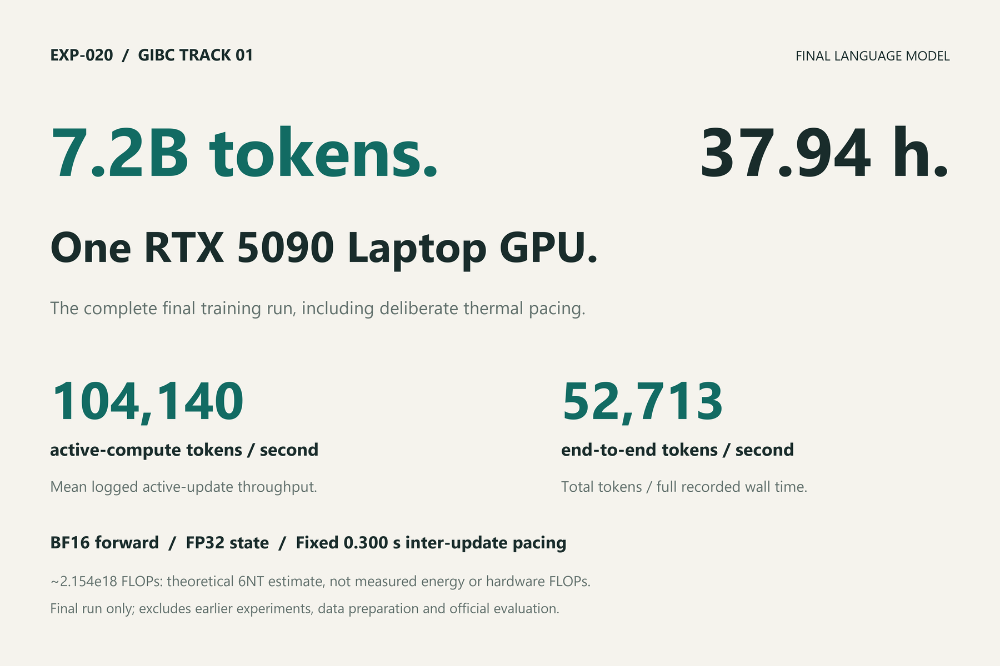
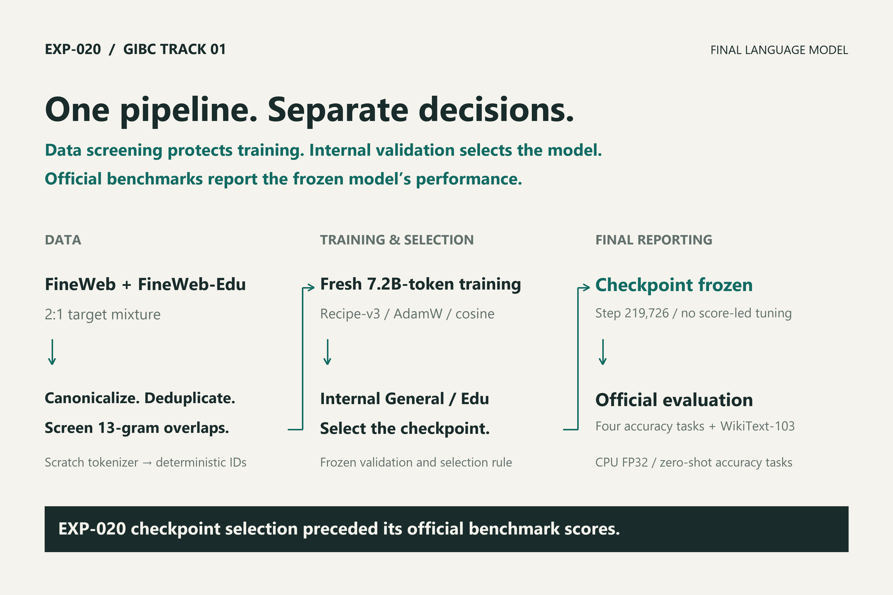
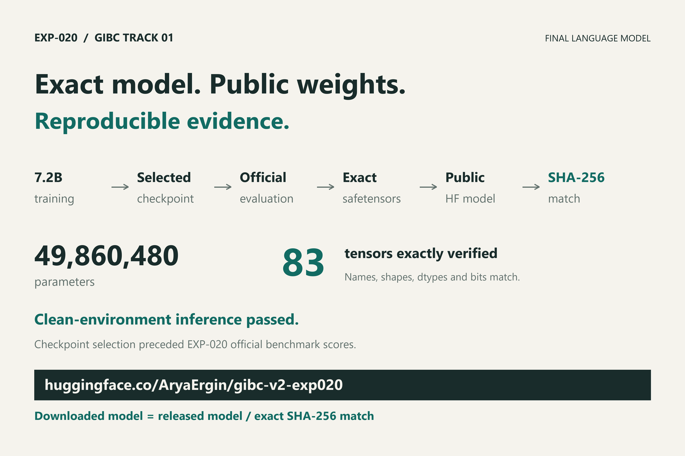

# EXP-020 · 31.783 WikiText-103 PPL at 49.86M parameters

**EXP-020 is the frozen competition model:** **49,860,480 trainable parameters** (below the 50M cap), **7,199,981,568 prediction tokens**, **one RTX 5090 Laptop GPU**, and **37.94 hours** of final training including thermal pacing. No pretrained model initialization, fine-tuning or distillation.

**[Download the frozen EXP-020 model, tokenizer and inference package](https://huggingface.co/AryaErgin/gibc-v2-exp020)** · [Pinned release and hash verification](docs/submission/PUBLIC_RELEASE.md)

| Required benchmark | Final result | EXP-012 reference | Change |
|---|---:|---:|---:|
| WikiText-103 held-out token PPL ↓ | **31.783** | 35.939 | −4.156 |
| HellaSwag acc_norm ↑ | **30.163%** | 28.759% | +1.404 pp |
| ARC-Easy acc_norm ↑ | **39.141%** | 36.448% | +2.694 pp |
| PIQA acc_norm ↑ | **60.446%** | 60.229% | +0.218 pp |
| WinoGrande acc ↑ | **48.777%** | 50.355% | −1.579 pp |

HellaSwag and ARC-Easy improved; PIQA was roughly stable; WinoGrande regressed. These are descriptive single-run comparisons, not evidence of universal reasoning improvement or statistical significance.

[Exact results & uncertainty](RESULTS.md) · [Frozen evidence & hashes](results/exp020-submission-evidence.json) · [Reproducibility](docs/submission/REPRODUCIBILITY.md) · [3:30 demo storyboard](docs/submission/DEMO_STORYBOARD.md)

**Frozen competition submission:** [`gibc-v2-track01-exp020-v1.0.0`](https://github.com/AryaErgin/gibc-v2-foundational-llm/tree/gibc-v2-track01-exp020-v1.0.0), commit `69f56d7b1f4f377f94a30216a9945df8a6662cce`. Later commits polish documentation/media only; the competition model and scores are unchanged.



## Run the public model — no GPU or benchmark download

Linux/WSL, Python **3.11** and Git are prerequisites. These commands install into a **new environment** and download the approximately **200 MB** public inference package. The qualified PyTorch wheel also installs multi-GB CUDA libraries even though this quickstart runs on CPU. Allow disk space and installation time; do not change an existing evaluation environment.

```bash
git clone https://github.com/AryaErgin/gibc-v2-foundational-llm.git
cd gibc-v2-foundational-llm
python3.11 -m venv .judge-venv
source .judge-venv/bin/activate
python -m pip install huggingface_hub==0.34.4
hf download AryaErgin/gibc-v2-exp020 \
  --revision c341f396bfb62d263e90d023c319a9dcdf21db4c \
  --local-dir ./exp020-package --exclude .gitattributes
python -m pip install torch==2.13.0 --index-url https://download.pytorch.org/whl/cu132
python -m pip install -r exp020-package/requirements.txt
export CUDA_VISIBLE_DEVICES=""
export OMP_NUM_THREADS=1 MKL_NUM_THREADS=1 OPENBLAS_NUM_THREADS=1 NUMEXPR_NUM_THREADS=1
sha256sum exp020-package/model.safetensors
python -B exp020-package/verify.py
python -B exp020-package/generate.py "The small robot moved" --temperature 0 --max-new-tokens 12
```

Expected weight SHA-256: `4c4f97801ce0c3d0cee52172bfe851b57690b81d153775a33107b8aaed1bc129`.
Verification must report `trainable_parameters: 49860480`, strict loading and finite CPU FP32 parameters. The package includes its own model code, tokenizer and config; no original training checkpoint, private path, dataset, repo installation or network is needed after download/install. It is a **base LM, not a chatbot**, and uses custom PyTorch code, not Transformers AutoModel.

**Fast checks versus full evaluation:** package verification and the short greedy example are lightweight local checks after installation. They do **not** run benchmarks. The official five-task CPU evaluation took roughly **20 hours**; it is a separate opt-in workflow, not a quickstart step. [Release instructions](docs/submission/EXP020_RELEASE.md) · [Evaluation reproduction and its artifact requirements](docs/submission/REPRODUCIBILITY.md).

## What we built—and learned

A compact decoder-only Transformer: 8,192-token byte-level BPE, width 640, nine blocks, twenty attention heads, SwiGLU, RoPE, pre-RMSNorm and tied embeddings. The final optimizer is ordinary AdamW with a cosine schedule fixed over all 219,726 updates. [Architecture and exact parameter accounting](ARCHITECTURE.md).

Our contribution is the experimental evidence and the instrument that produced it: controlled interventions, preregistered promotion gates, retained negative results, a deterministic contamination-screened corpus, and checkpoint selection using internal validation before final-model benchmark scoring.

Short-horizon wins did not consistently survive longer training here. WSD passed a replicated 300M-token comparison but missed its 2.4B gate; QK-Norm's advantage narrowed below its 1.5B promotion gate; Cautious Weight Decay's intermediate advantage reversed at 1.5B. None is in EXP-020. [Experiment decisions](EXPERIMENT_LOG.md) · [Method results](RESULTS.md).





*Development history, not a controlled scaling ablation: architecture, training budget and recipe changed. [All seven current figures and evidence captions](docs/assets/exp020-devpost/README.md).*

## Training and data

The final run read a non-cycled 2:1 FineWeb/FineWeb-Edu stream, built from zero with global exact-document deduplication. It contains **7,750,968 unique selected documents**. The first EXP-011 and EXP-012 token prefixes match their historical SHA-256 identities exactly. The frozen tokenizer was trained from scratch. [Data revisions, counts and contamination limits](DATA_SOURCES.md).

Training used WSL2, Python 3.11.9, PyTorch 2.13.0+cu132, BF16 forward computation with FP32 model/optimizer state, context 512, microbatch 32 × accumulation 2, seed 42, and fixed 0.300-second sleep after updates. Logged mean active throughput was 104,140 tok/s; mean paced step throughput was 53,276 tok/s. Total tokens divided by total training wall time is about 52,713 tok/s. Peak reserved VRAM was 8.680 GB decimal (8.084 GiB). The 37.94 hours describes this final run, not the entire research campaign. [Full training record](results/EXP-020-summary.md).

**Approximate final-run training compute:** using the conventional 6NT estimate, `6 × 49,860,480 × 7,199,981,568 = 2,153,967,221,829,795,840 FLOPs ≈ 2.154e18 FLOPs ≈ 2.154 EFLOPs`. This is an approximate theoretical training-compute estimate—not measured electrical energy, exact hardware FLOPs, or total research-campaign compute.



*Internal General/Edu validation and training loss, not official benchmark scores.*



## Frozen evaluation, transparent limitations

Official EXP-020 scoring completed on 2026-09-08, after checkpoint selection. The four multiple-choice tasks used unchanged lm-eval 0.4.9.1 task definitions, CPU FP32, zero-shot, batch 16, context 512. WikiText-103 used the separately pinned held-out rolling evaluator. Internal General/Edu validation selected the checkpoint; required benchmark results are final reporting only.

Historical models had earlier benchmark evaluations, and public benchmark text was used for exclusion screening. “Benchmark-blind selection” refers specifically to selection of the final EXP-020 checkpoint before its official scores, not a claim that no benchmark had ever been accessed.

The normalized 13-gram screen cannot rule out every semantic overlap. The final scale has one seed and no contemporaneous 7.2B alternative; performance changes cannot be causally assigned to an individual component. This is a base language model, not an instruction-tuned assistant. No SOTA, energy-efficiency or generalized-reasoning claim is made.

## Audit in minutes

The checked-in digest and figures can be inspected without weights, GPU access, network access or benchmark requests:

```bash
python scripts/verify_submission_package.py
```

The optional source-model count works in the quickstart environment with an explicit source import path (Linux/WSL, from the repository root):

```bash
PYTHONPATH=src python scripts/count_parameters.py \
  --config configs/exp020-final-7p2b-cosine.yaml --expected-total 49860480 --json
```

## Reproduce and inspect the evidence

The quickstart above is inference-only. For source-module development or parameter counting in a separate Python 3.11 environment, install the documented torch build, then `python -m pip install -e ".[dev]"`. This larger environment includes evaluator dependencies; installation does not execute benchmarks.

[Reproducibility](docs/submission/REPRODUCIBILITY.md) maps frozen artifacts and distinguishes public inference from owner-only full evaluation replay. The official evaluator is `scripts/run_exp020_official_sequence.py`; the [protocol](docs/EXP020_OFFICIAL_EVALUATION_PROTOCOL.md) documents exact task order and WikiText rolling semantics. Full evaluator commit: `37332797909df963ca7c77a945cea8752b60d481`; raw harness artifacts record short `3733279`. PIQA mirror/exclusion-snapshot byte equivalence is **not established**.





[Original publication smoke](docs/submission/PREPUBLICATION_SMOKE.md) · [Latest public-user audit](docs/submission/PUBLIC_USABILITY.md) · [Release hashes](docs/submission/PUBLIC_RELEASE.md).

## Submission map and credits

Training data: HuggingFaceFW FineWeb/FineWeb-Edu and Common Crawl. Frameworks/tools: Python, PyTorch/native SDPA, Hugging Face datasets/tokenizers/safetensors, EleutherAI lm-eval, NumPy, PyArrow, PyYAML and SQLite; NVIDIA RTX 5090 Laptop GPU/CUDA, Windows/WSL and OMEN; Git/GitHub, pytest and Pillow. Benchmark authors are credited in the [license/bibliography audit](docs/submission/LICENSE_AUDIT.md). [All six Devpost components and complete Built With checklist](docs/submission/COMPLIANCE.md).

- [Devpost draft](docs/submission/DEVPOST_DRAFT.md), [demo storyboard](docs/submission/DEMO_STORYBOARD.md), [skeptical judge review](docs/submission/JUDGE_REVIEW.md)
- [Results](RESULTS.md), [experiment log](EXPERIMENT_LOG.md), [current project status](PROJECT_PLAN.md)
- [Evidence audit](docs/submission/EVIDENCE_AUDIT.md), [official evaluation protocol](docs/EXP020_OFFICIAL_EVALUATION_PROTOCOL.md)
- [Source ledger](SOURCE_LEDGER.md), [code attribution](CODE_ATTRIBUTION.md), [bibliography](REFERENCES.bib), [license](LICENSE)

**AI assistance:** ChatGPT, Deep Research and OpenAI Codex supported research review, implementation, testing, profiling, audits and documentation. Human review retained scientific and publication authority. [Disclosure](AI_ASSISTANCE.md).
