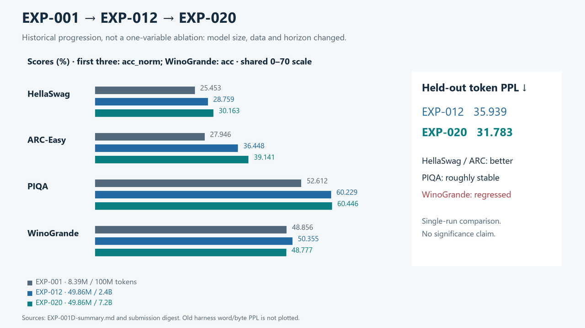

# Results — EXP-020 is the frozen competition model

Official evaluation completed **2026-09-08**. The terminal 7.2B checkpoint was selected using frozen internal validation before its official benchmark scoring. The checked-in [evidence digest](results/exp020-submission-evidence.json) contains exact values, source hashes, runtime metadata and task definitions extracted from immutable local outputs.

## Required official held-out evaluation

All accuracy values below are percentages; uncertainty is the **recorded harness standard error**, in percentage points. No new significance test or seed aggregation is implied.

| Task / metric | EXP-012 | EXP-020 | EXP-020 stderr | Δ (percentage points) | Effective examples |
|---|---:|---:|---:|---:|---:|
| HellaSwag acc_norm | 28.759211 | 30.163314 | 0.458029 | +1.404103 | 10,042 |
| ARC-Easy acc_norm | 36.447811 | 39.141414 | 1.001492 | +2.693603 | 2,376 |
| PIQA acc_norm | 60.228509 | 60.446137 | 1.140838 | +0.217628 | 1,838 |
| WinoGrande acc | 50.355170 | 48.776638 | 1.404828 | −1.578532 | 1,267 |

EXP-020 also records unnormalized accuracy: HellaSwag 28.301135%, ARC-Easy 42.382155%, PIQA 61.316649%. These do not replace the acc_norm metrics in the comparison.

| WikiText-103 held-out metric | EXP-012 | EXP-020 |
|---|---:|---:|
| Token perplexity | 35.93897257521639 | **31.783151406614728** |
| Mean token NLL (nats) | 3.581822293724097 | **3.4589363193959604** |
| Bits per UTF-8 byte | 1.4083853215598 | **1.3600661174573045** |
| Scored tokens / nonempty tokenized documents | 350,948 / 2,891 | 350,948 / 2,891 |

The WikiText evaluator also records 1,287,656 UTF-8 bytes. It uses `wikitext-103-raw-v1`, test split, revision `b08601e04326c79dfdd32d625aee71d232d685c3`, max sequence 512, context length 1, one EOD prefix per document, no added BOS/EOS, and every document token scored once.

The four harness tasks used zero-shot, CPU FP32, batch 16, context 512 and lm-eval 0.4.9.1. Their upstream scored splits are HellaSwag validation, ARC-Easy test, PIQA validation and WinoGrande validation; these are official benchmark partitions, distinct from the project's General/Edu development tensors. See [evaluation protocol](docs/EXP020_OFFICIAL_EVALUATION_PROTOCOL.md).

**Interpretation:** lower WikiText PPL; better HellaSwag/ARC-Easy; roughly stable PIQA; worse WinoGrande. This is a mixed capability profile. A single fresh final run and a historical reference do not establish causal attribution or universal reasoning improvement. The final recipe/checkpoint cannot be changed in response to these scores.

## Internal validation and selection

EXP-020 terminal General / Edu / Combined NLL: **3.1007972359657288 / 2.769774168729782 / 2.9352857023477554**. Combined is the equal-weight mean of the two domain means, not the 2:1 training-mixture loss.

EXP-012 terminal Combined was 3.020453929901123: the final endpoint change is −0.0851682275533676 nats. These endpoints used different fresh cosine horizons; EXP-020 at 2.4B is not an EXP-012 reproduction, because its learning rate is still defined by the 7.2B horizon.

The terminal checkpoint has the lowest Combined NLL among the preregistered candidates from 4.8B onward. The 0.003-NLL later-checkpoint preference therefore does not change the selection. Full milestones and runtime are in [EXP-020 summary](results/EXP-020-summary.md).

*EXP-001→EXP-012→EXP-020 shows development history, not a single-variable ablation. EXP-001's old harness WikiText word/byte PPL is deliberately excluded from the token-PPL comparison.*

## Controlled experiments and negative results

| Record | Comparison and recorded result | Final interpretation |
|---|---|---|
| [EXP-003](results/EXP-003-summary.md) | Pure Edu improved Edu but exceeded General regression limit | Not the final mixture |
| [EXP-004](results/EXP-004-summary.md) | Deterministic 2:1 mixture met both internal gates | Data Recipe v1 retained |
| [EXP-007](results/EXP-007-summary.md) | Near-cap candidates within 0.02 tie band | Recipe v2 by engineering tiebreak |
| [EXP-008](results/EXP-008-summary.md) | SwiGLU Combined change −0.0300662965 | Recipe v3 retained |
| [EXP-009](results/EXP-009-summary.md) / [010](results/EXP-010-summary.md) | Higher LR gain within tie band; alternate allocation slower | Original Recipe v3 retained |
| [EXP-013](results/EXP-013-summary.md) | WSD at 300M: −0.0337607563 (seed 42), −0.0273589939 (seed 43) | Initial proxy promotion, later superseded |
| [EXP-014](results/EXP-014-summary.md) | LLR at 300M: +0.0556223541 Combined | Reject |
| [EXP-015](results/EXP-015-summary.md) | Best curriculum gain −0.0058543086; required −0.010 | Reject; domain tradeoff retained |
| [EXP-016](results/EXP-016-summary.md) | Magma at 300M: +0.0922664553 | Reject; systems gate cannot rescue capability |
| [EXP-017A](provenance/exp017a-attempt-3-closure.json) | WSD 2.4B Combined 3.0358807147; gate ≤3.0104539299 | Execution pass; promotion fail |
| [EXP-018](provenance/exp018-closure.json) | QK-Norm 1.5B: −0.0121625066; required −0.015 | Promotion fail; no retuning |
| [EXP-019](provenance/exp019-closure.json) | CWD 1.5B: +0.0062686652; required ≤−0.010 | Reject; intermediate gain reversed |

WSD, QK-Norm and CWD demonstrate horizon-sensitive rankings in this project. This is not a universal claim that these methods fail. Most methods have one seed; only the recorded WSD proxy includes paired seed-43 confirmation. The comparisons use their own frozen controls, not a pooled ranking across incompatible budgets.

## Historical evidence remains intact

[EXP-001 training](results/EXP-001-summary.md), [EXP-001D evaluation](results/EXP-001D-summary.md), [EXP-006A](results/EXP-006A-evaluation.md), [EXP-011](results/EXP-011-summary.md), [EXP-012 training](results/EXP-012-summary.md), and [EXP-012 official provenance](results/exp012-official-provenance.json) are preserved.

Earlier EXP-001–006 “WikiText” figures used the harness word/byte-based task and are not directly comparable to the separate competition-correct WikiText-103 token-PPL evaluator. EXP-017 thermal aborts and the aborted EXP-020 data build are systems incidents, not scientific model results. The complete chronology remains in [EXPERIMENT_LOG.md](EXPERIMENT_LOG.md).
